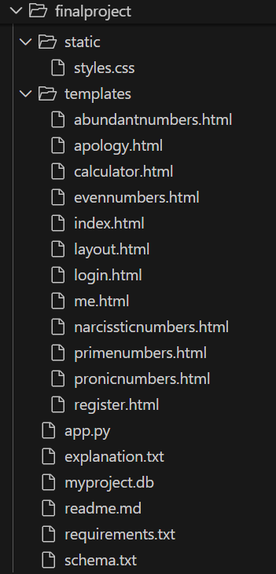

# Math&Numbers Assistant
Learning Platform

## 🎥 Demo Video
Watch the demo here: [CS50 Final Project Demo](https://youtu.be/xuWB_Oc7gKs)

## 📜 License / Credits
This project was developed as part of CS50’s Final Project.
All code and documentation were written by Irene von Ah.
Special thanks to the CS50 staff and community for guidance and inspiration.

## 📌 Project Information
- **Project**: Math&Numbers Assistant
- **Name**: Irene von Ah
- **GitHub Username**: imv2025
- **edX Username**: IreneIsabel2022
- **Location**: Luzern, Switzerland
- **Developed**: 26 Nov 2025

## 📌 About this project
Math&Numbers Assistant is an interactive learning platform dedicated to mathematical core concepts,
where students can test what they learned, read explanations, and reinforce knowledge.
To use this learning app, students need to register for later authentication.

## 🎯 Purpose
To engage others in my passion for Maths and Numbers.
These concepts are the core of many developments.

## 💡 Motivation
Numbers fascinate me because they are the foundation of engineering, science, and everyday life.
Sharing this passion through a web app inspires learners worldwide to see the beauty in mathematics.

## 📚 Educational Value
The platform as a learning companion encourages students to explore mathematical definitions,
validate their inputs, and reflect on explanations.
This active learning approach reinforces knowledge through active engagement and builds confidence.


## 🛠️ Blueprints
- **Controller**: `app.py`
- **Templates**: 12 dynamic HTML files
- **Static**: CSS for styling
- **Database**: `myproject.db` (SQLite, 3 tables: users, unique index, default sequence)
- **Text files**: `requirements.txt`, `explanation.txt`, `schema.txt`
- **Demo video**: 3‑minute walkthrough

## 🔑 Keywords
CS50, Web App, Flask, HTML, CSS, JavaScript, Jinja, Bootstrap, SQL, Database, Python, Math, Numbers, Learn

## 🔐 Authentication
- Students need to create an account to access the content.
- Features: Register, Log In, Log Out
- Implemented via HTTP POST with password security rules.

## 🎨 Appearance
- Bootstrap styling in a separate CSS file
- Toggle theme (light/dark mode)
- Responsive design for devices

## 📚 Core: Maths Concepts
- **Calculator**: addition, subtraction, multiplication, division
- **Number types**:
  - Abundant numbers: integers for which the sum of their proper positive divisors is greater than the number itself.
  - Even numbers: integers divisible by 2 without remainder.
  - Narcissistic numbers: non‑negative integer *n* such that the sum of its digits each raised to the power of the number of digits equals *n*.
  - Prime numbers: integers greater than 1 that have exactly two distinct positive divisors: 1 and themselves.
  - Pronic numbers: numbers formed by the product of two consecutive integers, n(n+1).

Each concept includes a short explanation and validation logic.
- If invalid → returns explanation + hints for the next attempt.
- If valid → returns the count, sum, and list of numbers up to the input.

## 👩‍💻 Developer Info
I am Irene von Ah, a Swiss Latin polyglot Electronics Engineer who loves learning and travel.
Mother of two daughters who increase my passion for caring for others.

## ⚡ Faced Challenges
Developing a project from scratch requires passion, planning, and resource management.
Clear statements helped me avoid wasted time and focus on the chosen direction.
I had to clarify which skills I already had and which I needed to accomplish my goal within the required time.

## 🚀 Next Features
- Expand the available selection of numbers (currently only 5 types).
- Implement a concept dictionary via GPT.
- Propose correlations between chosen numbers.

## 🎥 Demo Video
3‑minute walkthrough showing the main features of Math&Numbers app running via `flask run` and browser demo.
👉 [YouTube Demo Video](https://youtu.be/your-video-id)

## ⚙️ Installation
To run the app, clone the repository, create a virtual environment, install requirements, and run flask.
This ensures reproducibility and allows others to test the project exactly as I developed it.

1. **Clone the repository**
   ```bash
   git clone https://github.com/your-username/cs50-final-project.git
   cd cs50-final-project

2. **Create a virtual environment (recommended)**
    ```bash
    python -m venv venv
    source venv/bin/activate   # On macOS/Linux
    venv\Scripts\activate      # On Windows

3. **Install dependencies**
    ```bash
    pip install -r requirements.txt

Your Requirements.txt should contain:
    ```txt
    cs50
    Flask
    Flask-Session
    pytz
    requests

4. **Set environment variables (Flask needs this)**
    ```bash
    export FLASK_APP=app.py       # macOS/Linux
    set FLASK_APP=app.py          # Windows (PowerShell)

5. **Run the app**
    ```bash
    flask run

6. **Open in browser**
    ```code
    http://127.0.0.1:5000/

📂 File Structure

**app.py** → main Flask application
**explanation.txt** → CS50 reflection
**image.png** → File Structure screenshot
**myproject.db** → SQLite database
**README.md** → project documentation (this file)
**requirements.txt** → Python dependencies
**schema.txt** → database schema

**static/** → styles.css
**templates/** → 12 HTML templates

**layout.html** → abstraction html format to simplify the web maintenance

🔐 Authentication
**register.html** → registration with username and password
**login.html** → for each session needed
**apology.html** → if not valid authentication

⚙️ APP Core
**index.html** → provide mathematical definitions and routes to:
**calculator.html** → addition, subtraction, multiplication, division

**abundantnumbers.html**
**evennumbers.html**
**narcissticnumbers.html**
**primenumbers.html**
**pronicnumbers.html**
Each number type validates input, explains reasons, and returns count, sum, and list of numbers up to the input.

👩‍💻 Me
**me.html** → developer info: description and external links to linkedIn edX GitHub
